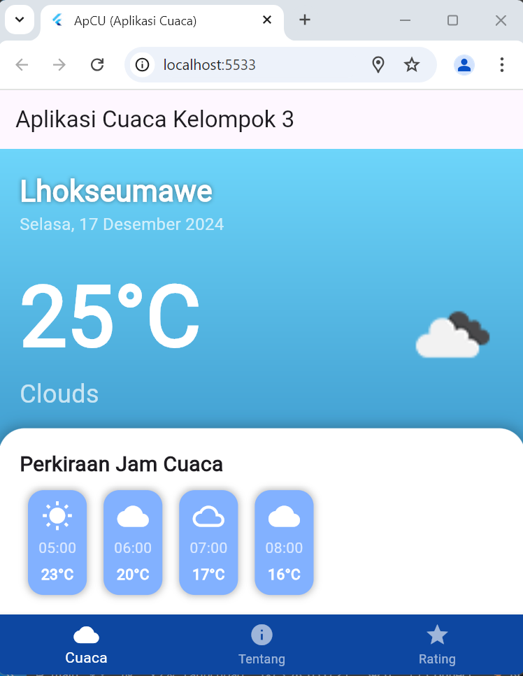

# aplikasi_cuaca_kelompok_3

Flutter project Cuaca.

Ketua : MUhammad Rizki
anggota: M. Akbar Zulfikar
Taufik Muhaimin
Cut Raysha
Aura Syaskia
Tri Kumala Sari

Tata cara ngeclone project ini untuk para anggota saya :

- git clone https://github.com/MuhammadRizki1303/aplikasi_cuaca_klmpk_3.git

Tata cara mengpush dan komen untuk project ini :

- git add .
- git commit -m "komentar anda disini kawanku"
- git push

Tata cara membuat branch

- git branch <nama branch kalian>

pindah branch

- git checkout <nama branch kalia>

melihat branch yang ada

- git branch

melihat branch yang ada direpository

- git branch -r

cara mengepush menggunakan branch

- git add .
- git commit -m "komentar kawanku sekalian disini"
- git push origin <nama branch kalian> / git push <nama branch kalian>

Depidensi yang diperlukan untuk para anggota saya :

dependencies:
flutter:
sdk: flutter
geolocator: ^10.0.1
intl: ^0.18.0
http: ^1.2.2
cupertino_icons: ^1.0.8

# Muhammad Rizki

## Pembuatan Struktur Project

- Pertama pembuatan struktur project
- Pembuatan UI beserta lainnya seperti navbar dan page rating serta page about us default

### Gambar Tampilan

- AURA SYASKIA
- (about_page)
  
  
  

Tentang Halaman "Tentang Kami" pada Aplikasi Cuaca
Halaman Tentang Kami dalam aplikasi ini dirancang untuk memberikan informasi kepada pengguna mengenai latar belakang aplikasi, tujuan pengembangannya, serta fitur unggulan yang ditawarkan. Berikut adalah detail tampilannya:
Desain Halaman

1. Header:
   Menampilkan nama aplikasi, yaitu "Aplikasi Cuaca", serta slogan "Menyediakan Prakiraan Cuaca Akurat untuk Hidup Lebih Terencana".
2. Sub-bagian "Siapa Kami?":
   Menjelaskan bahwa aplikasi ini dikembangkan oleh tim yang fokus menyediakan informasi cuaca terkini berbasis teknologi modern untuk membantu pengguna mempersiapkan diri menghadapi berbagai kondisi cuaca.
3. Sub-bagian "Keunggulan Kami"
   Data Akurat: Informasi cuaca yang bersumber dari data terpercaya dan diperbarui secara real-time.
   Antarmuka Mudah: Desain sederhana dan elegan untuk mempermudah pengguna dalam mengakses informasi.
   Notifikasi Penting: Memberikan notifikasi langsung terkait kondisi cuaca buruk atau ekstrem.
   Prakiraan Hujan: Menyediakan detail kemungkinan hujan dengan tingkat akurasi tinggi.

- CUT RAYSHA
  (rating_page)
  
  

  setelah pemberian rating
  

Deskripsi dari halaman Penilaian Aplikasi (rating_page)

1. Judul Halaman
   - "Penilaian Aplikasi" ditampilkan di bagian atas halaman, menunjukkan bahwa halaman ini bertujuan untuk meminta umpan balik dari pengguna.
2. Ikon Bintang
   - Ikon bintang berwarna kuning di tengah atas menunjukkan tema penilaian (rating).
3. Teks Penjelasan
   - Teks di bawah judul menyebutkan: _"Kami sangat menghargai masukan dan penilaian Anda untuk membantu kami meningkatkan aplikasi ini."_ Hal ini menunjukkan ajakan kepada pengguna untuk memberikan penilaian guna pengembangan aplikasi.
4. Rating Bintang
   - Lima bintang berwarna kuning memungkinkan pengguna untuk memberi penilaian dengan skala 1 hingga 5.
5. Simbol dan Keterangan
   - Ikon wajah tersenyum (emoji) dengan label "Sangat Puas" mencerminkan tingkat kepuasan pengguna.
6. Tombol Kirim
   - Tombol biru bertuliskan "Kirim Penilaian" digunakan untuk mengirimkan umpan balik pengguna.
7. Catatan Tambahan
   - Di bagian bawah, terdapat teks kecil bertuliskan: _"Terima kasih atas masukan Anda!"_ yang berfungsi sebagai ucapan terima kasih setelah penilaian diberikan.
8. Desain Visual
   - Latar belakang menggunakan gradasi biru muda dengan ilustrasi elemen matahari dan awan, menciptakan kesan ramah dan ceria.

Halaman rating page dirancang untuk mengumpulkan umpan balik pengguna dan menilai kinerja aplikasi melalui penilaian bintang. Data ini membantu pengembang memahami pengalaman pengguna, mengidentifikasi kekurangan, dan melakukan perbaikan untuk meningkatkan kualitas aplikasi sesuai kebutuhan pengguna. Desainnya yang sederhana dan ramah mendorong partisipasi pengguna dengan mudah. Dengan memberikan ruang untuk menyampaikan pendapat, halaman ini menciptakan pengalaman positif yang memperkuat kepuasan dan loyalitas pengguna, sekaligus membangun citra aplikasi yang peduli terhadap masukan mereka.

-TRI KUMALA SARI
(about_page)

Tentang Halaman "Tentang Kami" pada Aplikasi Cuaca
Halaman Tentang Kami dalam aplikasi ini dirancang untuk memberikan informasi kepada pengguna mengenai latar belakang aplikasi, tujuan pengembangannya, serta fitur unggulan yang ditawarkan. Berikut adalah detail tampilannya:
Desain Halaman

-AboutPage adalah StatefulWidget, yang artinya ia dapat menyimpan status yang dapat berubah selama siklus hidup widget.
-Metode ini createStatemembuat contoh \_AboutPageState, yang berisi logika dan UI untuk halaman ini.
-Metode ini dipanggil saat pengguna menekan tombol untuk mencari cuaca.
-Pembaruan dilakukan \_weatherInfodengan string yang menyertakan teks yang dimasukkan dalam kolom teks, yang mensimulasikan respons cuaca. setStatePanggilan tersebut memicu pembuatan ulang UI untuk mencerminkan status baru.

1. Scaffold : Menyediakan struktur untuk antarmuka visual, termasuk AppBar dan badan.
2. AppBar : Menampilkan judul "Tentang Kami" dengan warna latar belakang tertentu.
3. Padding : Menambahkan padding di sekitar konten utama halaman.
4. Kolom : Menyusun anak-anaknya secara vertikal.
5. Widget Teks : Menampilkan informasi statis tentang aplikasi dan perintah untuk pengguna.
6. TextField : Memungkinkan pengguna memasukkan nama wilayah untuk memeriksa cuaca.
7. ElevatedButton : Bila ditekan, ia memanggil \_searchWeathermetode.
8. Tampilan Info Cuaca : Menampilkan informasi cuaca yang tersimpan di \_weatherInfo.
